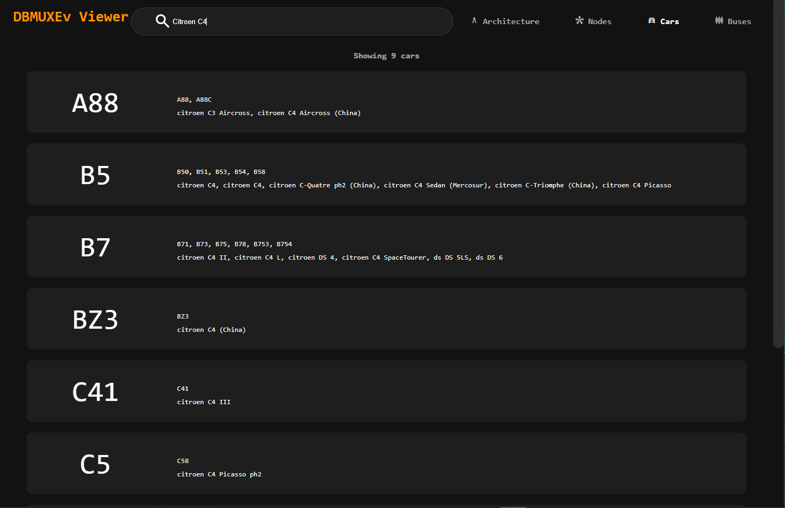
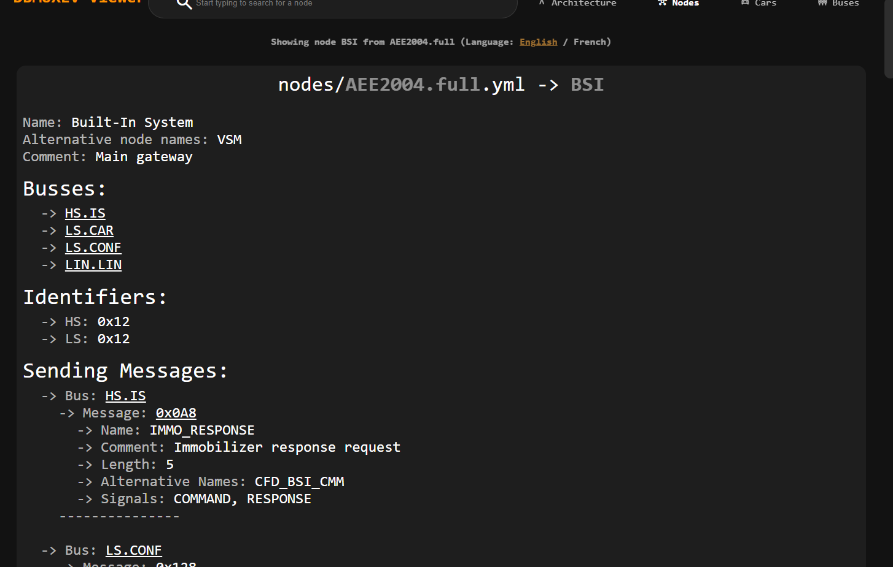
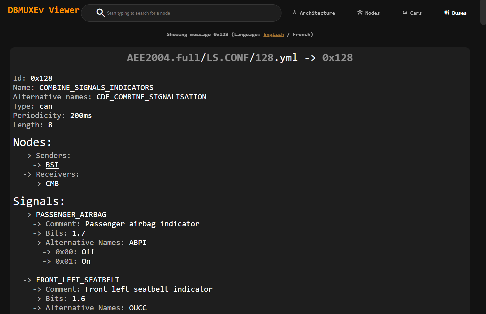
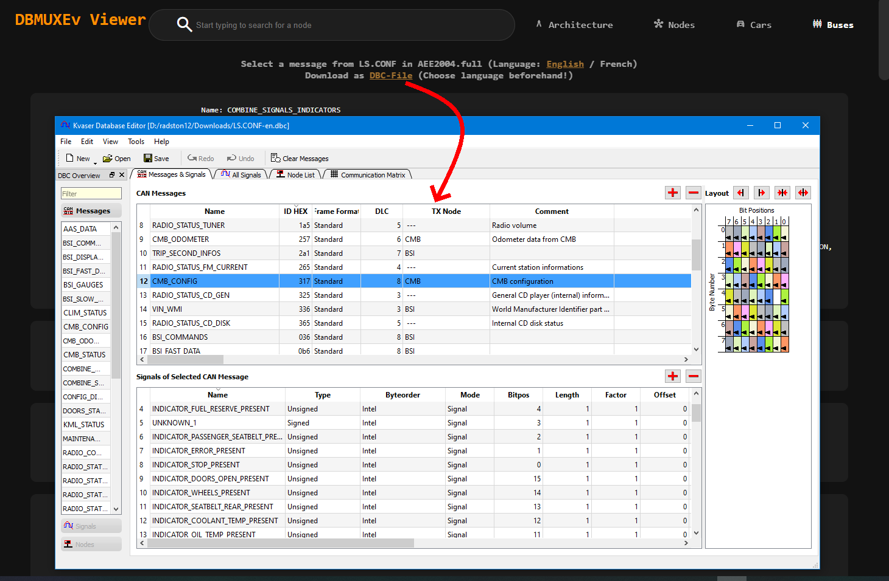

# DBMUXEv-Web

## Intro 

This tool is for looking at [DBMUXEv databases](https://github.com/RadSton/PSA-RE/tree/master/dbmuxev/doc#dbmuxev-format-specs-v01) and converting them it to a .dbc

In the future online editing and loading multiple DBs is also planned.

> [!WARNING]  
> This tool is still in development and probably still has many performance or stability issues. 


## Installation

To install this project run

```sh
git clone --recursive https://github.com/RadSton/DBMUXEv-Web.git
cd DBMUXEv-Web
npm i
```

> [!NOTE]  
> With the '--recursive'-argument the [PSA-RE database](https://github.com/RadSton/PSA-RE/tree/master) (fork from [prototux](https://github.com/prototux/PSA-RE)) database will automaticly downloaded as submodule into the 'db' folder!
>
> If you choose to not use '--recursive' you must edit ['configuration.json'](https://github.com/RadSton/DBMUXEv-Web/blob/master/docs/API_Doc.md) to load the database from another folder.

and to run 

```sh
npm start
```

> [!NOTE]  
> If your console output seems bugged or you redirected std::out to a file and has many invalid characters go into the [configuration.json](https://github.com/RadSton/DBMUXEv-Web/blob/master/docs/API_Doc.md) file and disable "ENABLE_COLOR_LOGGING"


A web server will start on port 3000 per default (see ['configuration.json'](https://github.com/RadSton/DBMUXEv-Web/blob/master/docs/API_Doc.md))

To exit out of it simply use `CTRL + C`

## Further documentation

[API Documentation](https://github.com/RadSton/PSA-RE/blob/web-dev/web/API_Doc.md)

[Config Documentation](https://github.com/RadSton/PSA-RE/blob/web-dev/web/Configuration_Doc.md)

## TODO / Current plans / Help appreciated

- In the future I plan on supporting "online" editing of the db.

## Pictures of the Web UI 






